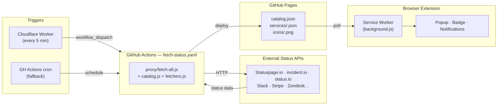
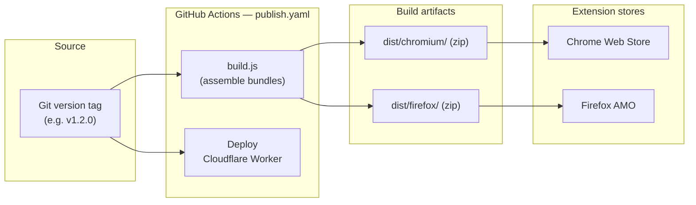

# Status Pages

A Chrome and Firefox MV3 extension that tracks service health pages and notifies you when something goes down or recovers.


---

## What it does

- Polls status pages for services you choose (GitHub, Stripe, AWS, Slack, Vercel…)
- Shows a live indicator in the toolbar badge
- Sends a browser notification on status changes
- Suggests adding a service when you visit a related page (e.g. opening `stripe.com` suggests tracking Stripe)
- Lets you track individual components of a service separately
- Shows a staleness banner in the popup if the status cache hasn't been refreshed recently

---

## Project structure

```
├── common/              Shared extension source (popup UI, icons, config template)
│   ├── background.js    Service worker logic — polling engine, alarms, notifications
│   ├── popup.html/js/css  Extension popup UI
│   ├── config.dist.js   Data source URL template (committed; auto-copied to config.js)
│   └── icons/           Toolbar icons (regenerated by create-icons.js)
├── chromium/            Chromium-specific files
│   ├── background.js    Shim: const browser = chrome; importScripts('common/background.js')
│   ├── browser-compat.js  Shim: const browser = chrome; (for popup scripts)
│   ├── manifest.json    MV3 manifest
│   └── common -> ../common  (symlink)
├── firefox/             Firefox-specific files
│   ├── background.js    Shim: importScripts('common/background.js')
│   ├── browser-compat.js  Empty — browser.* is native in Firefox
│   ├── manifest.json    MV3 manifest (includes browser_specific_settings.gecko)
│   └── common -> ../common  (symlink)
├── proxy/               Server-side cache layer
│   ├── catalog.js       Service definitions
│   ├── fetchers.js      Platform-specific fetch logic
│   ├── fetch-all.js     Fetches all services → proxy/dist/
│   ├── dev.js           Local dev server (patches config.js, serves proxy/dist/)
│   └── dist/            Generated status cache, gitignored
├── build.js             Assembles dist/chromium/ and dist/firefox/ for publishing
├── create-icons.js      Regenerates common/icons/ from scratch
├── cron-worker/
│   ├── worker.js        Cloudflare Worker — triggers fetch-status every 5 min
│   └── wrangler.toml    Wrangler config (name, cron schedule)
└── .github/
    ├── ISSUE_TEMPLATE/  Bug report, improvement, and new-service issue forms
    └── workflows/
        ├── fetch-status.yaml  Fetches status cache and publishes to GitHub Pages
        └── publish.yaml       Builds, packages, and publishes extensions + worker on version tags
```

---

## Architecture

### Runtime — status data flow



### Build & release pipeline



---

## Local development

Requires **Node 24** (LTS). No npm install needed.

```bash
node proxy/dev.js
# or on a different port:
node proxy/dev.js 8080
```

This will:

1. Write `chromium/config.js` and `firefox/config.js` pointing at the local server
2. Start an HTTP server on the specified port (default: 3001) serving `proxy/dist/` with CORS headers
3. Run `proxy/fetch-all.js` immediately to populate `proxy/dist/`, then every 5 minutes
4. Restore both `config.js` files to the production URL when you press Ctrl+C

**Load the extension in Chrome:**

1. Open `chrome://extensions`
2. Enable **Developer mode**
3. Click **Load unpacked** → select the `chromium/` folder

**Load the extension in Firefox:**

1. Open `about:debugging#/runtime/this-firefox`
2. Click **Load Temporary Add-on** → select `firefox/manifest.json`

> **Tip:** if you edit `proxy/catalog.js` or `proxy/fetchers.js`, re-run `node proxy/fetch-all.js` manually to rebuild `proxy/dist/` immediately, then reload the extension.

**Run the integration tests** (hits real APIs):

```bash
node test/integration.js
```

---

## Building for release

```bash
node build.js <version>   # e.g. node build.js 1.2.0
```

Outputs self-contained, production-ready extensions to `dist/chromium/` and `dist/firefox/` (gitignored). Each bundle has the version injected into its manifest and the dev-only `localhost` host permission removed.

---

## Polling policy

The background service worker schedules the next poll based on the `generatedAt` and `ttl` fields embedded in each cached service file:

- **Next poll at** `generatedAt + ttl + 2 min` — waits until the next cache generation is expected to be available.
- **Retry every 10 s** if that time is already past (workflow delayed or behind schedule).
- **Fallback to 60 s** on fetch error (no `generatedAt` available).

The watchdog alarm fires every 5 minutes to restart any stalled poller. Chrome enforces a ~30 s minimum for alarms in production builds.

---

## Adding a new service

### 1. Identify the platform

Check the status page URL and try `/api/v2/status.json`. Common platforms:

| Response shape | Type to use |
|---|---|
| `{ status: { indicator }, components }` | `statuspage` or `incidentio` |
| `{ page: { state } }` at `/api/v1/status` | `sorryapp` |
| `api.status.io/1.0/status/{pageId}` | `statusio` |
| Custom API | Write a new fetcher (see below) |

### 2. Add a catalog entry in `proxy/catalog.js`

```js
{
  id: 'myservice',
  name: 'My Service',
  type: 'statuspage',               // platform type
  pageUrl: 'https://status.myservice.com',
  apiBase: 'https://status.myservice.com/api/v2',
  relatedDomains: ['myservice.com', '*.myservice.com'],
  searchAliases: ['keyword', 'another name'],
}
```

**Fields:**

| Field | Required | Description |
|---|---|---|
| `id` | ✓ | Unique slug, kebab-case |
| `name` | ✓ | Display name |
| `type` | ✓ | Platform type (see `proxy/catalog.js` header for full list) |
| `pageUrl` | ✓ | Human-readable status page |
| `apiBase` | ✓ | API base URL used by the fetcher |
| `relatedDomains` | | Domains that trigger the "+" badge suggestion. Patterns starting with `*.` match subdomains. |
| `searchAliases` | | Extra search terms (product names, acronyms) |
| `pageId` | for `statusio` | status.io page hash |
| `beta` | | Shows a "beta" badge in the UI |

### 3. Run the integration test

```bash
node test/integration.js
```

Look for your service in the output. A `✓` with a component count and description means it works.

---

## Writing a new fetcher

If the service uses a custom API, add a fetcher to `proxy/fetchers.js`:

```js
async function fetchMyServiceStatus(service) {
  const res = await fetch(`${service.apiBase}/current`);
  if (!res.ok) throw new Error(`HTTP ${res.status}`);
  const data = await safeJson(res);

  const indicator  = data.status === 'ok' ? 'none' : 'major';
  const components = data.services.map(s => ({
    id:     s.id,
    name:   s.name,
    status: s.healthy ? 'operational' : 'major_outage',
  }));

  return makeResult(indicator, data.message, components);
}
```

Then register it in the dispatcher at the bottom of `proxy/fetchers.js`:

```js
if (service.type === 'myservice') return fetchMyServiceStatus(service);
```

**Result shape** (from `makeResult`):

| Field | Type | Description |
|---|---|---|
| `indicator` | `'none' \| 'minor' \| 'major' \| 'critical'` | Worst-case status |
| `description` | `string` | Short human-readable summary |
| `components` | `{ id, name, status }[]` | Per-component breakdown |
| `activeIncidents` | `{ name, shortlink }[]` | Ongoing incidents |

**Component status values:** `operational`, `degraded_performance`, `partial_outage`, `major_outage`, `under_maintenance`.

> `proxy/fetchers.js` runs server-side only (via `proxy/fetch-all.js`). It has no browser API dependencies — keep it that way so it continues to work in Node.js.

---

## Status cache (GitHub Actions)

Instead of each browser polling N status APIs independently, a GitHub Actions workflow fetches everything periodically and publishes the results to GitHub Pages. The extension reads from this shared cache via `config.js`.

**A note on schedule frequency:** GitHub Actions throttles high-frequency `schedule:` triggers — in practice `*/5 * * * *` runs roughly **once per hour**. A Cloudflare Worker (see below) is used as the primary 5-minute trigger; the native GH Actions schedule remains as a fallback.

**Setup:**
1. Push the repo to GitHub
2. Go to **Settings → Pages → Source** and select **GitHub Actions**
3. Trigger the workflow manually from the **Actions** tab to prime the cache on first use

**Published files:**

```
https://<user>.github.io/<repo>/catalog.json          # service list + live status + icons
https://<user>.github.io/<repo>/services/<id>.json    # one result file per service
https://<user>.github.io/<repo>/icons/<id>.png        # cached service favicons
```

Each file includes `generatedAt` (ISO timestamp) and `ttl` (seconds) so consumers know when the next generation is expected.

**Run the fetch manually:**

```bash
node proxy/fetch-all.js
# writes proxy/dist/catalog.json, proxy/dist/services/*.json, proxy/dist/icons/*.png
```

**`common/config.dist.js`** is the committed template holding the production GitHub Pages URL. **`chromium/config.js`** and **`firefox/config.js`** are gitignored — `proxy/dev.js` writes them with the localhost URL and restores the originals on exit. `build.js` copies the template as `config.js` inside each built extension bundle.

---

## Cron Worker (Cloudflare)

`cron-worker/` contains a Cloudflare Worker that triggers the GitHub Actions workflow every 5 minutes via `workflow_dispatch`, bypassing GitHub's cron throttling. It is free within Cloudflare's free tier (100k req/day).

**One-time setup:**

1. Create a GitHub [Personal Access Token](https://github.com/settings/tokens) with the **`workflow`** scope (classic token) or **Actions: Read and write** (fine-grained token).
2. Authenticate with Cloudflare:
   ```bash
   npx wrangler login
   ```
3. Store the PAT as a Worker secret:
   ```bash
   cd cron-worker
   npx wrangler secret put GITHUB_PAT
   ```
4. Deploy:
   ```bash
   npx wrangler deploy
   ```

The worker is redeployed automatically by CI on each version tag (`publish.yaml`). Add **`CLOUDFLARE_API_TOKEN`** and **`CLOUDFLARE_ACCOUNT_ID`** to the repository secrets for CI deployment to work.

> The `GITHUB_PAT` secret is stored in Cloudflare (via `wrangler secret`) and never touches GitHub secrets or this repository.

---

## Supported platforms

| Type | Used by |
|---|---|
| `statuspage` | GitHub, Cloudflare, Stripe, Figma, Vercel, Netlify… |
| `incidentio` | OpenAI, Miro, Linear, Resend… |
| `slack` | Slack |
| `uptimerobot` | Packagist |
| `statusio` | Docker, GitLab, Neon |
| `google` | Google Workspace, Google Cloud |
| `zendesk` | Zendesk |
| `auth0` | Auth0 |
| `statuscast` | Fastly |
| `pagerduty` | PagerDuty |
| `algolia` | Algolia |
| `heroku` | Heroku |
| `stripe` | Stripe |
| `sorryapp` | Postmark |
| `awshealth` | AWS Health *(beta)* |
