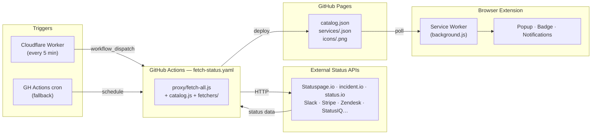
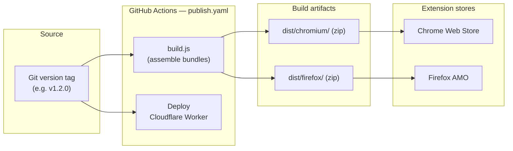

# Status Pages

A Chrome and Firefox MV3 extension that tracks service health pages and notifies you when something goes down or recovers.


---

## What it does

- Polls status pages for services you choose and shows a live indicator in the toolbar badge
- Sends a browser notification when a service goes down or recovers
- Lets you track individual components of a service (e.g. only "Git Operations" from GitHub)
- Suggests adding a service when you visit a related domain (e.g. opening `stripe.com` suggests tracking Stripe)
- Shows a staleness banner in the popup when the status cache is overdue

---

## Tracked services

78 services across all major categories.

### AI & LLMs
- [Claude](https://status.claude.com)
- [OpenAI](https://status.openai.com)

### Analytics & Data
- [Algolia](https://status.algolia.com)
- [Metabase](https://status.metabase.com)
- [PostHog](https://www.posthogstatus.com)
- [Segment](https://status.segment.com)
- [Snowflake](https://status.snowflake.com)

### CI/CD & Developer Tools
- [CircleCI](https://status.circleci.com)
- [ConfigCat](https://status.configcat.com)
- [Cursor](https://status.cursor.com)
- [GitHub](https://www.githubstatus.com)
- [GitLab](https://status.gitlab.com)
- [LaunchDarkly](https://status.launchdarkly.com)
- [npm](https://status.npmjs.org)
- [Packagist](https://status.packagist.org)
- [Python Infrastructure](https://status.python.org)
- [Travis CI](https://www.traviscistatus.com)

### Cloud & Infrastructure
- [AWS Health](https://health.aws.com/health/status) *(beta)*
- [Clever Cloud](https://www.clevercloudstatus.com) *(beta)*
- [Cloudflare](https://www.cloudflarestatus.com)
- [DigitalOcean](https://status.digitalocean.com)
- [Docker](https://www.dockerstatus.com)
- [Fastly](https://www.fastlystatus.com)
- [Fly.io](https://status.flyio.net)
- [Google Cloud](https://status.cloud.google.com)
- [Heroku](https://status.heroku.com)
- [Netlify](https://netlifystatus.com)
- [Render](https://status.render.com)
- [Vercel](https://www.vercel-status.com)

### Collaboration & Productivity
- [Airtable](https://status.airtable.com)
- [Atlassian](https://status.atlassian.com)
- [Dashdoc](https://www.dashdocstatus.com)
- [Dropbox](https://status.dropbox.com)
- [Figma](https://status.figma.com)
- [Harvest](https://www.harveststatus.com)
- [Linear](https://linearstatus.com)
- [Loom](https://loom.status.atlassian.com)
- [Miro](https://status.miro.com)
- [Notion](https://www.notion-status.com)

### Communication
- [Discord](https://discordstatus.com)
- [Intercom](https://www.intercomstatus.com)
- [Mastodon Social](https://status.mastodon.social)
- [Signal](https://status.signal.org) *(beta)*
- [Slack](https://slack-status.com)
- [Twilio](https://status.twilio.com)
- [Zoom](https://status.zoom.us)

### Databases & Storage
- [Cloudinary](https://status.cloudinary.com)
- [Hasura](https://hasura-status.com)
- [MongoDB Atlas](https://status.mongodb.com)
- [Neon](https://neonstatus.com)
- [PlanetScale](https://www.planetscalestatus.com)
- [Supabase](https://status.supabase.com)
- [Upstash](https://status.upstash.com)

### Email
- [Postmark](https://status.postmarkapp.com)
- [Resend](https://resend-status.com)
- [SendGrid](https://status.sendgrid.com)

### Identity & Security
- [1Password](https://status.1password.com)
- [Auth0](https://status.auth0.com)
- [Bitwarden](https://status.bitwarden.com)
- [Dashlane](https://status.dashlane.com)
- [Proton](https://status.proton.me)
- [Tailscale](https://status.tailscale.com)

### Monitoring & Observability
- [Datadog](https://status.datadoghq.com)
- [Grafana](https://status.grafana.com)
- [New Relic](https://status.newrelic.com)
- [PagerDuty](https://status.pagerduty.com)
- [Sentry](https://status.sentry.io)

### Payments & Commerce
- [HubSpot](https://status.hubspot.com)
- [Plaid](https://status.plaid.com)
- [Shopify](https://www.shopifystatus.com)
- [Stripe](https://status.stripe.com)

### SaaS Suites
- [Google Workspace](https://www.google.com/appsstatus/dashboard)
- [ManageEngine](https://status.manageengine.com)
- [Zendesk](https://status.zendesk.com)
- [Zoho](https://status.zoho.com)

### Signing & Compliance
- [DocuSign](https://status.docusign.com)
- [PandaDoc](https://status.pandadoc.com)
- [YouSign](https://yousign.statuspage.io)

---

## Contributing

### Updating the service cloud image

The image at the top of this README is a static PNG generated from the catalog. Regenerate it after adding or removing a service:

```bash
# Requires ImageMagick (apt install imagemagick)
node proxy/fetch-all.js      # refreshes proxy/dist/icons/ with any new service icons
./icon-cloud/build.sh        # composites them into icon-cloud/service-cloud.png
```

Icons are read from `proxy/dist/icons/` (local), so no push is needed before regenerating. Commit the updated `icon-cloud/service-cloud.png` alongside your catalog change.

---

### Adding a service to the catalog

#### 1. Identify the platform

Check the status page URL and try `<url>/api/v2/status.json`. Common patterns:

| Response shape | Type to use |
|---|---|
| `{ status: { indicator }, components }` at `/api/v2` | `statuspage` or `incidentio` |
| `{ page: { state } }` at `/api/v1/status` | `sorryapp` |
| `api.status.io/1.0/status/{pageId}` | `statusio` (requires `pageId` field) |
| `{pageUrl}/sp/api/u/summary_details` | `site24x7` |
| Custom shape | Write a new fetcher — see below |

#### 2. Add an entry to `proxy/catalog.js`

The catalog is a plain object keyed by service id (kebab-case), sorted alphabetically. Add your entry in the right position:

```js
const CATALOG = {
  // …
  'myservice': {
    name: 'My Service',
    type: 'statuspage',
    pageUrl: 'https://status.myservice.com',
    apiBase: 'https://status.myservice.com/api/v2',
    relatedDomains: ['myservice.com', '*.myservice.com'],
    searchAliases: ['keyword', 'another name'],
  },
  // …
};
```

| Field | Required | Description |
|---|---|---|
| `name` | ✓ | Display name |
| `type` | ✓ | Platform type (see full list in `proxy/catalog.js` header) |
| `pageUrl` | ✓ | Human-readable status page URL |
| `apiBase` | ✓ | API base URL used by the fetcher |
| `relatedDomains` | | Domains that trigger the "add service" suggestion. `*.` prefix matches all subdomains. |
| `searchAliases` | | Extra search keywords (product names, acronyms) |
| `pageId` | `statusio` only | status.io page identifier |
| `beta` | | Shows a "beta" badge in the UI |

#### 3. Validate and test

```bash
node proxy/validate-catalog.js   # checks required fields, kebab-case keys, valid types
node test/integration.js         # hits real APIs — look for ✓ next to your service
```

#### 4. Rebuild the icon cloud

```bash
node proxy/fetch-all.js   # downloads the new service icon into proxy/dist/icons/
./icon-cloud/build.sh     # regenerates icon-cloud/service-cloud.png
```

Commit `icon-cloud/service-cloud.png` alongside the catalog change.

---

### Writing a new fetcher

If the service uses a custom API not covered by an existing type, create `proxy/fetchers/myservice.js`:

```js
'use strict';

const { Incident }  = require('../../common/value-objects/incident.js');
const { Component } = require('../../common/value-objects/component.js');
const { Service }   = require('../../common/value-objects/service.js');
const { safeJson }  = require('./_helpers.js');

async function fetchMyServiceStatus(service) {
  const res = await fetch(`${service.apiBase}/current`);
  if (!res.ok) throw new Error(`HTTP ${res.status}`);
  const data = await safeJson(res);
  if (!data) throw new Error('Invalid response');

  const components = data.services.map(s => new Component({
    id:     s.id,
    name:   s.name,
    status: s.healthy ? 'operational' : 'major_outage',
  }));

  return new Service({
    id:             service.id,
    name:           service.name,
    description:    data.ok ? 'All Systems Operational' : 'Service disruption',
    pageUrl:        service.pageUrl,
    relatedDomains: service.relatedDomains ?? [],
    searchAliases:  service.searchAliases  ?? [],
    fetchedAt:      new Date().toISOString(),
    components,
  });
}

module.exports = { fetchMyServiceStatus };
```

Then:

1. Register it in `proxy/fetchers/index.js`:
   ```js
   const { fetchMyServiceStatus } = require('./myservice.js');
   // …
   if (service.type === 'myservice') return fetchMyServiceStatus(service);
   // export it too
   ```

2. Add `'myservice'` to `VALID_TYPES` in `proxy/validate-catalog.js`.

**Component status values:** `operational` · `degraded_performance` · `partial_outage` · `major_outage` · `under_maintenance`

> Fetchers run server-side only (Node.js via `proxy/fetch-all.js`). Keep them free of browser API dependencies.

---

## Technical reference

### Project structure

```
├── common/              Shared extension source
│   ├── background.js    Service worker — polling engine, alarms, notifications
│   ├── popup.html/js/css  Extension popup UI
│   ├── config.dist.js   Data source URL template (committed; dev.js copies it as config.js)
│   ├── value-objects/   Shared domain types: Status, Component, Incident, Service
│   └── icons/           Toolbar icons (regenerated by create-icons.js)
├── chromium/            Chromium-specific files
│   ├── background.js    Shim: const browser = chrome; importScripts('common/background.js')
│   ├── browser-compat.js  Shim: const browser = chrome; (for popup scripts)
│   ├── manifest.json    MV3 manifest
│   └── common -> ../common  (symlink)
├── firefox/             Firefox-specific files
│   ├── background.js    Shim: importScripts('common/background.js')
│   ├── browser-compat.js  Empty — browser.* is native in Firefox
│   ├── manifest.json    MV3 manifest (includes browser_specific_settings.gecko)
│   └── common -> ../common  (symlink)
├── proxy/               Server-side cache layer
│   ├── catalog.js       Service definitions (keyed object, alphabetically sorted)
│   ├── fetchers/        Platform-specific fetch logic (one file per type)
│   │   ├── index.js     Dispatcher — routes service.type to the right fetcher
│   │   ├── _helpers.js  Shared utilities (safeJson, distributeIncidents…)
│   │   └── *.js         One fetcher per platform type
│   ├── fetch-all.js     Fetches all services and writes proxy/dist/
│   ├── validate-catalog.js  Validates catalog.js entries
│   ├── dev.js           Local dev server
│   └── dist/            Generated status cache (gitignored)
├── test/
│   └── integration.js   Integration tests — hits real APIs
├── build.js             Assembles dist/chromium/ and dist/firefox/ for publishing
├── create-icons.js      Regenerates common/icons/ from scratch
├── icon-cloud/
│   ├── build.sh         Regenerates icon-cloud/service-cloud.png (README service grid)
│   └── service-cloud.png  Generated service icon grid (committed)
├── cron-worker/
│   ├── worker.js        Cloudflare Worker — triggers fetch-status every 5 min
│   └── wrangler.toml    Wrangler config
└── .github/
    ├── ISSUE_TEMPLATE/  Bug report, improvement, and new-service issue forms
    └── workflows/
        ├── fetch-status.yaml  Fetches status cache and publishes to GitHub Pages
        └── publish.yaml       Builds, packages, and publishes extensions + worker on version tags
```

---

### Architecture

#### Status data flow



#### Build & release pipeline



---

### Supported platform types

| Type | Used by |
|---|---|
| `statuspage` | GitHub, Cloudflare, Figma, Vercel, Netlify, and most others |
| `incidentio` | OpenAI, Miro, Linear, Resend, Dashdoc, Hasura |
| `slack` | Slack |
| `uptimerobot` | Packagist |
| `statusio` | Docker, GitLab, Neon |
| `google` | Google Workspace, Google Cloud |
| `zendesk` | Zendesk |
| `auth0` | Auth0 |
| `statuscast` | Fastly |
| `pagerduty` | PagerDuty |
| `algolia` | Algolia |
| `heroku` | Heroku |
| `stripe` | Stripe |
| `sorryapp` | Postmark |
| `awshealth` | AWS Health *(beta)* |
| `posthog` | PostHog |
| `hund` | Bitwarden |
| `cachet` | Clever Cloud *(beta)* |
| `signal` | Signal *(beta)* |
| `instatus` | Mastodon Social |
| `site24x7` | ConfigCat, ManageEngine, Zoho |

---

### Local development

Requires **Node 24** (LTS). No `npm install` needed.

```bash
node proxy/dev.js
# or on a different port:
node proxy/dev.js 8080
```

This will:
1. Write `chromium/config.js` and `firefox/config.js` pointing at the local server
2. Start an HTTP server on the specified port (default: 3001) serving `proxy/dist/` with CORS headers
3. Run `proxy/fetch-all.js` immediately to populate `proxy/dist/`, then every 5 minutes
4. Restore both `config.js` files to the production URL when you press Ctrl+C

**Load the extension in Chrome:**
1. Open `chrome://extensions`
2. Enable **Developer mode**
3. Click **Load unpacked** → select the `chromium/` folder

**Load the extension in Firefox:**
1. Open `about:debugging#/runtime/this-firefox`
2. Click **Load Temporary Add-on** → select `firefox/manifest.json`

> **Tip:** after editing `proxy/catalog.js` or any fetcher, re-run `node proxy/fetch-all.js` manually to rebuild `proxy/dist/` immediately, then reload the extension.

---

### Building for release

```bash
node build.js <version>           # e.g. node build.js 1.2.0
node build.js <version> --debug   # enables console logging for each fetch in the service worker
```

Outputs self-contained extensions to `dist/chromium/` and `dist/firefox/` (gitignored). Each bundle has the version injected into its manifest and the dev-only `localhost` host permission removed.

---

### Status cache (GitHub Actions)

Instead of each browser independently polling all status APIs, a GitHub Actions workflow fetches everything periodically and publishes the results to GitHub Pages. The extension reads from this shared cache via `config.js`.

**Setup:**
1. Push the repo to GitHub
2. Go to **Settings → Pages → Source** and select **GitHub Actions**
3. Trigger the workflow manually from the **Actions** tab to prime the cache on first use

**Published files:**
```
https://<user>.github.io/<repo>/catalog.json          # service list + live status + icons
https://<user>.github.io/<repo>/services/<id>.json    # one result file per service
https://<user>.github.io/<repo>/icons/<id>.png        # cached service favicons
```

Each file includes `generatedAt` (ISO timestamp) and `ttl` (seconds) so consumers know when the next generation is expected.

**Run manually:**
```bash
node proxy/fetch-all.js
# writes proxy/dist/catalog.json, proxy/dist/services/*.json, proxy/dist/icons/*.png
```

The Cloudflare Worker below is the primary 5-minute trigger; the native GH Actions `*/5` schedule is a fallback.

---

### Cron Worker (Cloudflare)

`cron-worker/` contains a Cloudflare Worker that triggers the GitHub Actions workflow every 5 minutes via `workflow_dispatch`, bypassing GitHub's cron throttling. It runs within Cloudflare's free tier (100k req/day).

**One-time setup:**
1. Create a GitHub [Personal Access Token](https://github.com/settings/tokens) with the **`workflow`** scope
2. Authenticate with Cloudflare:
   ```bash
   npx wrangler login
   ```
3. Store the PAT as a Worker secret:
   ```bash
   cd cron-worker && npx wrangler secret put GITHUB_PAT
   ```
4. Deploy:
   ```bash
   npx wrangler deploy
   ```

The worker is redeployed automatically by CI on each version tag. Add **`CLOUDFLARE_API_TOKEN`** and **`CLOUDFLARE_ACCOUNT_ID`** to the repository secrets for this to work.

> The `GITHUB_PAT` is stored in Cloudflare (via `wrangler secret`) and never touches this repository.

---

### Polling policy

The background service worker schedules the next poll based on `generatedAt` and `ttl` from the cached service file:

- **Next poll at** `generatedAt + ttl + 30 s` — waits until the next cache generation is expected
- **Retry every 10 s** if that time is already past (workflow delayed or behind schedule)
- **Fallback to 60 s** on fetch error (no `generatedAt` available)

`ttl` is dynamic per service: **360 s** (6 min) when the last status was fully operational, **60 s** (1 min) otherwise — so degraded services are re-checked much more frequently.

The watchdog alarm fires every 5 minutes to restart any stalled poller. Chrome enforces a ~30 s minimum for alarms in production builds.

---

### Error reporting

When `proxy/fetch-all.js` encounters a fetch failure, it writes a structured log to `proxy/dist/logs/<id>.log`:

```
[2026-04-15T18:46:19Z] [incidentio] apiBase=https://status.openai.com/api/v2
TypeError: Component status must be one of [operational, …], got "full_outage"
    at new Component (common/value-objects/component.js:28:13)
    at fetchIncidentioStatus (proxy/fetchers/statuspage.js:82:16)
    …
```

The `fetch-status.yaml` workflow uploads these logs as a CI artifact and posts them as structured comments on a per-service GitHub issue (auto-created on first failure, reopened on recurrence). Each occurrence is a collapsible block showing the timestamp, fetcher type, API base URL, and full stack trace.
